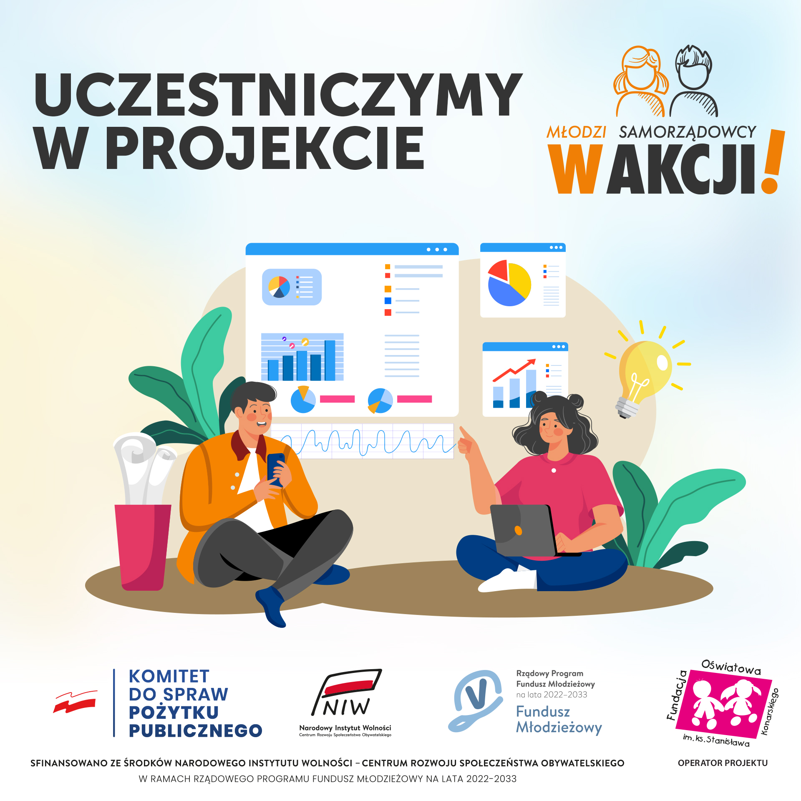

# Machine Learning — Praktyczne Umiejętności
## Repozytorium zawiera materiały wykorzystane w kursie

### Spotkanie 1
- Materiały:
  - [Notebook](https://colab.research.google.com/drive/1A5QiFxXWcde60p6ahggQV3x7m1RTFoNN?usp=sharing)
  - [Prezentacja](static/presentation_1.pdf)
- Główne tematy:
  - podstawy sieci neuronowych
  - biblioteka PyTorch
### Spotkanie 2
- Materiały dostępne [tutaj](https://docs.google.com/document/d/1KtTaog1_CSFUdx1dvZ7neq-C8LKWp_aUlPymLb0T7sI/edit?usp=sharing).
- Główne tematy:
  - Przegląd i praca z dostępnymi modelami "State of the Art"
  - Praca z literaturą naukową

### Spotkanie 3
- Materiały:
  - [notebook](https://colab.research.google.com/drive/1StT8UAklpEylOybvzkpWWD91C0YRaj24?usp=sharing)
- Główne tematy:
  - Trening i inferencja z wykorzystaniem pretrenowanych modeli
  - Praca na zewnętrznych serwerach
### Spotkanie 4
- Materiały:
  - [Repo Github](https://github.com/rafaltobiasz/ml-workflow-workshop)
- Zaplanowane tematy:
  - Jak wygląda codzienny workflow pracy nad modelami ML — eksperymenty, debugging i organizacja projektów. 
  - Narzędzia wspomagające pracę researchera ML: zdalne uruchamianie eksperymentów, monitoring i wizualizacja wyników.
